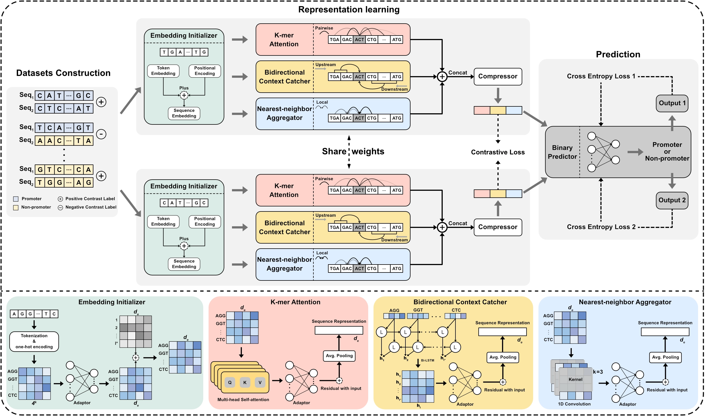

# SiamProm: a framework for cyanobacterial promoter identification

SiamProm originated from the paper **Recognition of Cyanobacteria Promoters via Siamese Network-based Contrastive Learning under Novel Non-promoter Generation**.

## The architecture of SiamProm




## Dependency

| Main Package 	| Version 	|
| ------------	| -------:	|
| Python       	| 3.9.18  	|
| Pytorch      	| 1.13.1  	|
| CUDA         	| 11.6.1   	|
| Scikit-learn  | 1.3.2   	|
| Pandas      	| 2.1.4   	|
| Hydra        	| 1.3.2   	|
| Pyyaml      	| 6.0.1   	|

Build your environment manually or through a yaml file.

### YAML file

```bash
conda env create -f env_SiamProm.yaml
conda activate SiamProm
```

## Usage

```bash
python train.py sampling=phantom
```

Optional values for the parameter `sampling` are `phantom`(default), `random`, `cds`, and `partial`.

> For more detailed instructions on parameter management and configuration usage, please refer to the [Hydra](https://hydra.cc/docs/1.3/intro/) documentation.