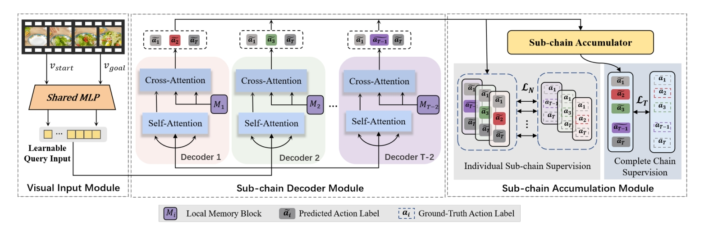

# Skip-Plan: Procedure Planning in Instructional Videos via Condensed Action Space Learning
This is a Mindspore implementation for *Skip-Plan: Procedure Planning in Instructional Videos via Condensed Action Space Learning* in IEEE International Conference on Computer Vision (ICCV), 2023. 

Please read the original paper or original pytorch implementation for a more detailed description of the training procedure.

# Table of Contents

- [Project Title](#project-title)
- [Table of Contents](#table-of-contents)
- [Model Architecture](#model-architecture)
- [Installation](#installation)
- [Dataset](#dataset)
- [Usage](#usage)
- [Reference](#reference)

# Model Architecture



# Installation

[(Back to top)](#table-of-contents)

- Hardware

  - Support GPU environment.

- Packages

  - python==3.8.17
  - Mindspore==2.1.0

  - Install other packages pip install -r requirements.txt

# Dataset

[(Back to top)](#table-of-contents)

Download and Set-up CrossTask Dataset

```shell
cd datasets/CrossTask_assets
wget https://www.di.ens.fr/~dzhukov/crosstask/crosstask_release.zip
wget https://www.di.ens.fr/~dzhukov/crosstask/crosstask_features.zip
wget https://vision.eecs.yorku.ca/WebShare/CrossTask_s3d.zip
unzip '*.zip'
```

# Usage

[(Back to top)](#table-of-contents)

### Quick Start

```sh
cd skipplan/scripts/ # please enter this path before bash XXX.sh, otherwise path errors :)
bash run_train_cont.sh
bash run_test_cont.sh
bash run_train_tower4.sh
bash run_test_tower4.sh
```

### Train

T = 3:

```shell
python train_cont.py
```

T = 4:

```shell
python train_tower4.py
```

### Test

1. prepare pretrained models：

   You can find my pretrained models in `pretrained_model` folder.

2.  Run inference code：

   T = 3:

   ```
   python test_cont.py
   ```

​       T = 4:

```
python test_tower4.py
```


# Reference

[(Back to top)](#table-of-contents)

Please kindly cite the original paper references in your publications if it helps your research.

Please kindly reference the url of MindSpore repository in your code if it helps your research and code.
